# Business Models & IT organizations: Brace for Impact! 

Many of the readers likely have heard about Clayton Christensen’s seminal book called “The Innovator's Dilemma”. I would like to paraphrase a section from his book here to illustrate how AI-SWE is going to gain its foothold.

*Clayton Christensen differentiates between two types of innovation: sustaining and disruptive. Sustaining innovation involves enhancing existing technologies, where new market entrants often struggle to compete against established companies who can easily integrate such improvements into their existing products. On the other hand, disruptive innovation emerges when products become overly sophisticated for their market, leading to an "over-served" market. This creates opportunities for new innovations that, although they might be inferior to current state-of-the-art products, offer functionality at a lower cost or in a manner unattainable by the leading products.*

Ok, now that you got a refresher of this concept, hold this thought! We will revisit it shortly, but first let's introduce an emergent organization, the AI-Native firm.

 

## Beware the Rise of the AI-Native Firm

Just like we saw the advent of cloud-native firms with the growing ubiquity and economy of cloud computing, which started to come in and change the landscape, we will now see AI-native firms get formed.

As software engineering becomes more and more accessible through generative AI, new companies will be able to create software without hiring a lot of expensive software developers. Indeed, there is now a new profession emerging, called the AI engineer [16]. It will work at a level higher than the actual development of the code, and will focus on training the models and creating the glue to bring the software created by these AI functions into the hands of the end-users. 

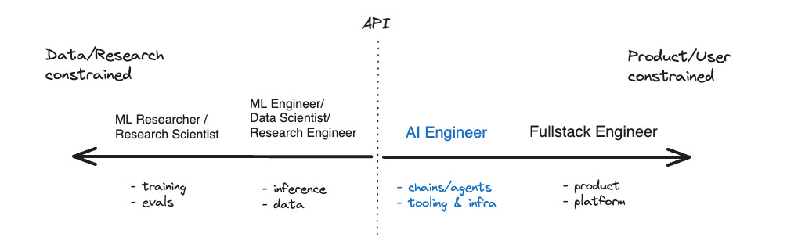*Source: [16] Swyx: The Rise of the AI engineer*

AI-native firms would not have to deal with the bureaucracy and friction that inevitably settles in with legacy software processes or older architecture, infrastructure, platforms, framework or language decisions made in the past. They would be able to build and deploy software using the best, more ubiquitous and economical patterns available. What's more, if they made the wrong technical decision, no worries, just scrap it all and re-build it back afresh quickly! 

AI-native firms would not take 9 to 18 months in stealth-mode, as has been common in Silicon Valley. All the stages of new technology development, from prototype to Minimum Viable Product (MVP) would be measured in weeks. It would get easier and cheaper for VCs to fund these companies, as they would be able to easily pivot when the promising product turns out to be a dud. These firms will start infiltrating all industries, from taxes to medical care management, and will either start to threaten the incumbents or would get acquired (or aqui-hired given the number of employees would be so small). More importantly, they would rapidly reduce the perception of time-to-market for products in the eyes of the customer, which would all but force the existing successful firms to disrupt themselves.

So, back to Clayton’s concept around disruptive technologies… AI-SWE is going to be inferior to human software engineering in the beginning, but nothing will be able to compete with its dramatic speed, and low cost. Customers will do a cost-benefit assessment and choose to bypass bells and whistles and select simpler but much cheaper alternatives which have the ability to evolve rapidly. All the AI-native firms have to ensure is to not compromise on the fundamentals like reliability and security and provide the core value that the customers are looking for.

## How does this impact IT 

Currently in existing successful companies, IT (centralized or distributed) builds or buys much of the technology that is used to “go to market”. This ranges from Sales technologies like CRM systems and e-commerce, to marketing technologies like digital online presence and events tech, to customer support technologies like ticketing systems and even data engineering, analytics and science like data pipelines, dashboards, or propensity to buy models. 

*Note: Here, when I reference IT, I am encompassing all the technology organizations in the company. They could be centralized in a formal IT function, or distributed within independent lines of business. This AI wave will not discriminate. It is going to hit them all.*

The company can evolve only as fast as these technologies can evolve. The pressure of reduced time to market created by AI-native firms will eventually be felt by the IT teams within existing companies. Most IT firms are now encouraging their engineers to safely experiment with AI, and that is good. However, I believe the ones that will start **proactively** preparing for this wave will position their companies to not only break away from their competition but also stay resilient in this new AI-powered economy. 

## The journey of each IT organization will be unique

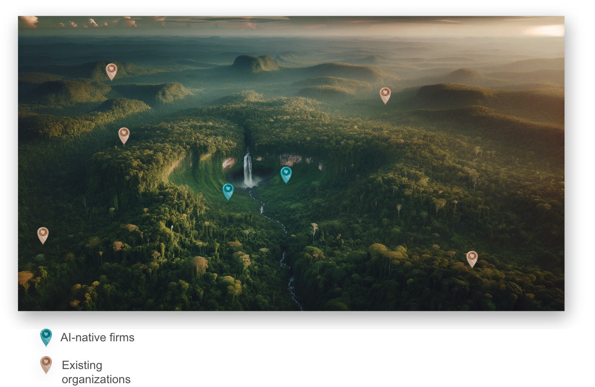

*Source: DALL-E, and the author’s imagination*

I’d like you to imagine the waterfall in the middle of the forest above as the value that will be created by AI. All the AI-Native firms will camp closer to this waterfall, their application architectures, development processes and teams streamlined exclusively for AI-SWE

All the existing firms however are located further away. Each of them is starting from a different place. Some are using languages and platforms which won’t be able to benefit from AI. Others have brittle and complex architectures, maybe built from years of inorganic growth (acquisitions) which won’t lend themselves for AI agents to easily plug in autonomously and contribute, and so on.

In terms of the Software Development Life Cycle (SDLC) , **All of these** existing firms will have their own unique customization of the work management systems, unique processes of how low-level feature breakdown occurs, their own source code branching strategies, their own software gates (code smell %, unit test coverage) down to their own standards of how each contributing developer even structures the comment for each github pull request

Each of these above aspects would need to change in the AI-driven world. The AI agents would need to be taught the expectations of what must be in the pull request, of what documentation must be updated in the work management systems, or how to build and interact with the testing environments, how to create the change approval documentation and so on. **And this would be different for each IT firm.** Stated simply,

> The impetus to become AI-driven must come from inside IT, as no outside entity knows IT better than itself.

We will see a lot of snake-oil salesmen: companies that will pitch this promised land to the IT executives. Even if they have a compelling platform, 60-70% of the work would be adoption and integrating their platform into the existing processes, tools and culture.

This may feel daunting for the IT executive to take on. However, let’s always remember that we’ve been here before. Recall the times when we were all moving out of our data centers into the public cloud, or even years back, when we were establishing continuous integration for our software teams, or when we were moving from our ad hoc way of doing work to standardized PaaS platforms. As executives we have managed these major changes in our companies before. 

All we have to do is define a high level structure and plan to get there. Drawing from the numerous change initiatives in my career, I have thought a lot about this AI wave and will attempt to explain one possible way to do this. Note that this is just my perspective, and I know there will be other approaches. 

My goal in sharing this approach is to start your idea machine churning and give you a running start on this journey.

# A possible bridge to the future

One thing I’ve learnt in my career as a leader is it is easy to talk about the ideal target state, because it has been published heavily in books and talks, and it is also easy to admire our current state problems. The hard work is to build a bridge from the current state to the future. Each step on this bridge has to be planned and thought through. The first step needs to be close enough to the current state so that the organization is able to make a transition naturally. The subsequent steps cannot be too far apart, or your people would be hesitant to step across. These steps should logically build on top of each other.

*Source: DALL-E, and the author’s imagination*

I’ve attempted to articulate these steps in terms of phases, starting with the current state that most of us find ourselves in IT:

## Current state

Currently, several IT organizations are experimenting with AI and encouraging their software engineers to use and embrace AI-augmented code development. The typical approach taken by the engineers is to install an extension on their Interactive Development Environment (IDE) and as they write, they use special keyboard shortcuts to kick in the code helper Agent which reviews their code, or perhaps a comment instructing what is required in that section of the file, and then the helper auto-suggests a few lines of code which the engineer can accept or decline [17].

There are multiple options available for these roles to get assistance below are just a few examples:

- Github co-pilot - by far the most pervasive IDE extension for developers - powered by openAI’s GPT4 LLM.
- Many, many IDE extensions (e.g. Code GPT) several of which allow you to use OSS LLMs instead of GPT4.
- Free IDE extensions by tech firms extending their capabilities for greater adoption. Examples:
  - Proprietary programming languages (e.g Einstein for Developers extension by Salesforce for the Apex language real-time auto-completion)
  - Core technical competencies (SonarLint extension by SonarSource which focuses on catching quality issues as you code)
  - Extending Platform capabilities (CAST Highlight extension to review software structural safety, pre-acquisition due-diligence of software IP etc)

A typical product delivery team within IT may look something like this today:

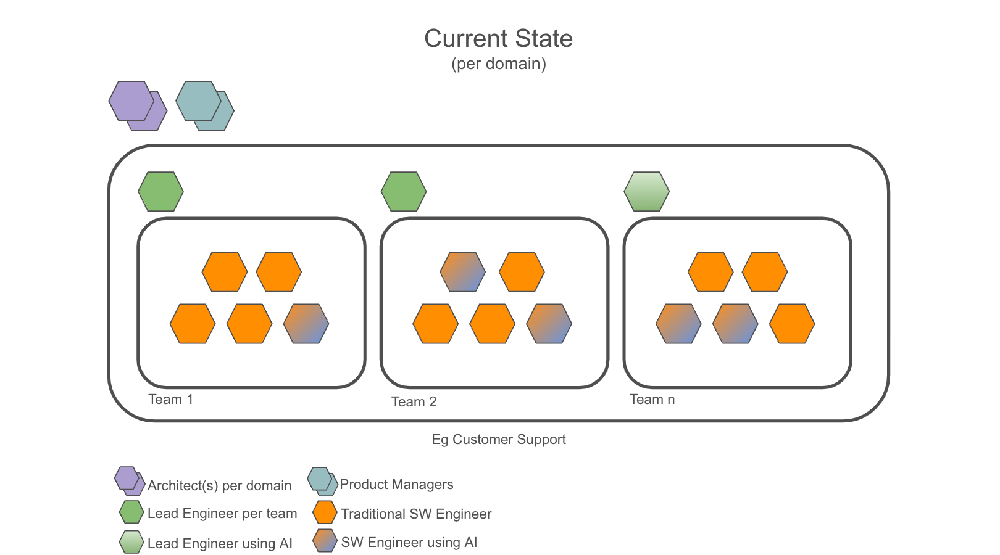

*Source: Author*

Some engineers have started playing with these IDEs, perhaps some lead engineers for scrum teams as well. Across the IT department it may AI-assisted development also be catching on organically. 

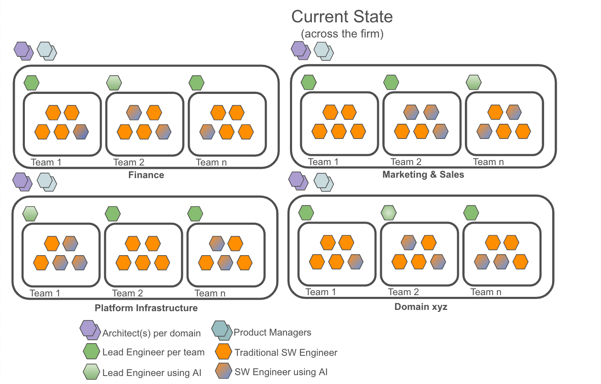

*Source: Author*

AI-assisted development is an excellent first step and all software engineers must be encouraged and championed internally to exploit these as much as possible within the bounds of company security policies. 

However, to borrow a phrase from statistics, **this is necessary but not sufficient.** 

While there is a general amorphous uplift for all developers by using these capabilities, in order to truly introduce the “disruptive” changes we mentioned earlier, there is some level of **dedicated** energy, thought and structure that needs to be put in place. This takes us to the first phase of the journey:

## Phase 0 : Assessment and Planning

> If you fail to plan, then you plan to fail.

Before any concrete actions like team formations etc are done, an assessment exercise needs to be conducted to understand and define the overall scope and goals for bringing AI-driven engineering to the IT organization. A solid plan would drive executive confidence, and right-size any investment asks for the future phases. 

To create a realistic and actionable plan, it is important to look at the processes, tools and technologies from the lens of the AI software agent we will introduce. Key areas to document through this exercise would be:

1. <u>Evaluate key software development processes</u>

   Stripped down to the core, what are the current processes every human software engineer must partake in today to be able to contribute code to deliver features? Examples here include planning, sizing, developing, adherence to the peculiar branching strategy, running specific test suites, specific coding, unit-test and documentation requirements etc.

   

   *In other words what are key low-level software development processes that the AI software development agents would also need to integrate into to be practically useful.*

   

   This is an important exercise because, in all IT organizations, there are a lot of higher-order processes that are useful for coordination, communication purposes but do not directly contribute to shipping features. Examples include weekly leadership reports, status updates to senior leadership, coordination meetings across multiple domains. Typically any work that is driven by Technical Program Managers can be included in this bucket. Integrating AI-driven engineering is not going to influence those directly (Yes, AI will influence these higher-order processes *indirectly* in a profound way, but that is beyond the scope of this writeup).

   

   This evaluation and documentation will help scope out the extra services that may need to be written for the AI-SWE teams to plug them into the existing software delivery workflow.

2. <u>Evaluate current IT infrastructure and environments</u>

   When using AI-agent engineering, there are non-trivial issues related to dependency management within the application (i.e. the version of run-time, the libraries being used etc) and API-based dependencies on neighboring applications. My initial experimentation with autonomous AI surfaced various such challenges with deploying software in environments (I’ll document them later in a more technical writeup). There is the matter of authentication management of the application beyond a “local” setup. There may be some manual steps a developer needs to take to be fully provisioned in deploying to that environment. Such a setup would need to be replicated for each AI agent, and obviously automated as much as possible to easily be able to add AI agent capacity with minimal manual effort. In short, detailed “low-level” documentation of what it takes a software engineer starting from scratch in developing some software locally, then deploying to a shared QA environment , and then promoting that code to higher environments all the way into production is essential to identify the roadblocks an AI-agent will face.

    

   In many cases we will need to be ready to not have a 100% path of automated continuous **deployment** (CD) to production in the beginning if CD is not in place for human-driven software engineering (H-SWE) today. For instance, if there are humans involved in the change and release management process to ship features to production today, that would still be there when semi-autonomous AI-SWE teams are creating software features by themselves. That doesn’t stop the AI-SWE teams from creating and surfacing all required documentation and testing output to the change board and release managers. (Over time, change and release processes can definitely be powered by AI (not coding, but reasoning) agents as well but that is beyond the scope of this document)

   

   Similar to the software process evaluation, environment evaluation will also show what other capabilities need to be streamlined for AI-SWE to be able to stay as autonomous as code gets promoted through higher environments all the way to production.

   

3. <u>Identify all applications where AI can be integrated (complexity and impact)</u> 

   There will be hundreds of candidate applications where AI-SWE could be inserted. However, a careful evaluation of the complexity of processes surrounding each application’s SDLC, the maturity of the AI-coder LLMs for each application’s language, and the level of impact of AI-SWE on that application will be required. Just like in story pointing, Fibonacci scoring can be used against the cost and benefit dimensions and an overall ROI metric can be created which can help executives decide the order of the AI-SWE agent deployment (more in Phase 2 below).

   

   Important note: At the bottom of the priority list of applications need to be all those applications where there is already significant context loss [18]. The problem statement must be kept true to building AI-SWE teams and not to dilute to include legacy applications that mysteriously work and no one really understands how.

   

4. <u>Develop a timeline and roadmap for the transition</u>

   Of course, no planning phase is complete without a published roadmap, and one would be required here as well. As an executive I love defining timelines, because it forces my team and I to think in terms of real dates, and deadlines, and enables us to think about all aspects and stages of the project holistically. Of course, “no plan survives first contact with the enemy” as Sun Tzu stated. These timelines do, and will change, especially since this type of work has never been done before. We truly don’t know what surprises are in store for us on this journey, and there is no user manual out there for this yet. (In fact, to the best of my knowledge, this article may be the first real attempt at a framework from an experienced product leader who’s been in the trenches).

   
   
   All those aside, the plan will still give a clear baseline and identify all the assumptions. As surprises emerge, the plan can be reviewed and adjusted. However, those deadlines will still be out there, publicly communicated and they always drive a healthy pressure on the team to keep sharp focus and deliver. For all new projects or features, I always say:

> *“dates can’t change but scope can”*

5. <u>AI technology selection</u>

   Some time should be put aside to do a POC-driven technology selection. It would be good to have some high level clarity on which horse to back (aka which base models to fine tune). These models should be able to serve the maximum number of the applications in the first quartile of the priority list coming out of step 3 above. However, we must be able to stay flexible here. This space is rapidly evolving and innovation may come out later this year that requires us to change our choices. What is important here is to focus on the non-regrettables, by asking questions such as: 

   - Does the AI technology (the multi-agent frameworks etc) allow us to translate architecture, handling coding, debugging, QA and operations tasks? 
   - Do these frameworks allow us to easily swap LLMs? 
   - Are there common benchmarks we can define which enable us to evaluate the framework’s performance?

   

   This selection must be based on multiple proof of concepts which show how AI-SWE can integrate with environments and software tooling. There are plenty of cute AI-SWE applications out there like snack-game, count to 100, and printing hello world in multiple languages. The POCs here should focus on simple but real use cases that are applicable within IT. It is these POCs which will give us some level of confidence and show a realistic delta from here to the desired target state which we can put a reasonable level of effort estimation against.

   
   
   To work on this evaluation and planning assessment, I recommend a small team comprising of:
   
   - a competent software engineering leader who knows how the sausage factory works in terms of software creation in the firm, and is knowledgeable and passionate about the intersection of generative AI. They will be a core change agent for this transformation and will drive this change for the organization.
   - an architect experienced with taking their architectures into production working closely with engineering teams. This needs to be someone who understands the development process within IT, as well as has a deep grounding on the core architectural principles defined by the IT Enterprise Architecture group to ensure they are reflected in the solution.
   - A lead engineer within one of the initial target domains who has in-depth and hands-on experience with the full software lifecycle from requirements, to sizing, to environments, to code reviews. I suspect the lead will intuitively know where the low hanging fruits are where AI agents have the best chance of productive contribution to the team.

## Phase 1 : Establishing an AI Shared Services group

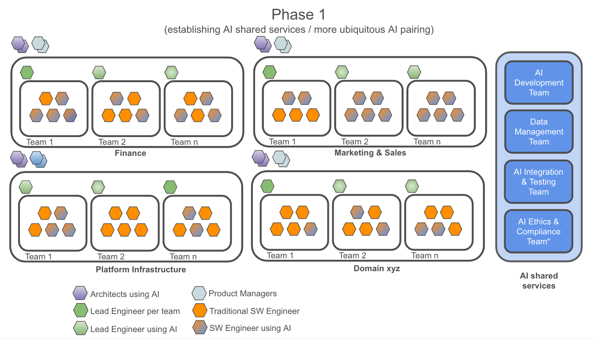

*Source: Author*

While the bottom-up organic usage of AI-assisted human software development must continue, a dedicated team would sharpen focus on bringing AI-SWE into reality.

Specifically , this group would focus on four distinct areas. I broke these apart based on the unique skill set and the unique cognitive complexity that applies to each of them. 

No organizational design in the world is perfect. They tend to optimize for some gain while sacrificing another. The organizational design that I put forward optimizes parallelism and scale with as much autonomy as can be afforded to the individual teams, with the key operative focus on “moving fast”. These teams are:

### 1. AI Development Team

- **Primary Role:** Develop, customize, and maintain AI models, especially LLMs, for various software development tasks. This development will start from pre-trained base models and fine tune them on the application teams’ internal software and documentation. 

  

- **Responsibilities:**
  - AI Model Customization: Focus on fine-tuning pre-trained LLMs to understand the domain team’s specific codebase, software architecture documentation, and domain knowledge as much as possible. This would be relying on high quality curated data by the data management team (see #2 below). In several cases the application code that the Model would be fine-tuned for would be written in languages already understood by the base model (such as Microsoft's Phi-2). However, fresh research may be required in languages that have not been trained to these models such as Terraform which is primarily used by infrastructure automation teams.
    AI Model Quality Assurance (QA): Test AI models to ensure they meet functional requirements and performance benchmarks. These AI models must meet a robust evaluation criteria and objective performance metric. A good outside-in test of the output would be the pull requests the AI-SWE agents would send to the lead engineers. However, based on the leads’ feedback the performance metrics would need to be codified and baked into the model creation pipeline. This team should also explore newly developed methods in academia like BotChat [9] to measure the quality produced by multi-agent AI-SWE teams.
    
  - Research and Development: Stay abreast of the latest AI advancements and incorporate them into your systems.
  
    
  
- **Skills Required:** knowledge of the software teams specific tech stack, software development and systems integration. 
  - *I do* **not** *believe a practitioner level of data science knowledge is really required for this team since a lot of OSS capabilities like AutoGPT [19] have already been created to assist with fine-tuning of base models. This team is not going to be doing a lot of data-science or ML work like pre-training models on TPU chips in GCP, but it will be a true engineering team, taking the lego blocks and building out an AI-software engineering capability, building on top of the OSS base models. Essentially, the skills we are going to need here are solid software engineers. This team however will need to have a general idea of how pre-trained coding models [20] were created, and will need to stay on top of the latest developments in the field of multi-agent software development which is why the R&D responsibility has been noted above.*
  - *Later on in a more advanced stage, this team may require to pre-train its own models, which may require data scientists and investment in cloud compute spend, but investing so heavily in this space before proving out real value doesn’t make business sense when a lot of uplift can be gained by building on top of pre-trained models.*

### Data Management Team

- **Primary Role:** Manage the data required for training and refining AI models. This team would need to understand what type, quality and format of the data is needed for the training of the models by Team 1, and then be able to collect and annotate this data. In early days, this and the AI development team may be one and the same, but eventually for scaling purposes, this would need to stand as a separate team. In fact, in the beginning creating sample data sets to fine tune the models would likely be done by the AI Development team (1) anyway, and would only hand this work off to this team when scaling out across multiple applications and then multiple domains.
  I found a prototype [21] put out by Autogen very applicable where, by pointing an AI agent towards decent code documentation (aka Retrieval Augmented Generation, or RAG) they demonstrated how the AI agent was able to learn syntax of some new methods in the library and provide code based on that. We may or may not choose to use the RAG method here but the example clearly shows this can be done.
  
  
  
- **Responsibilities:**
  - Data Collection and Annotation: Gather and label data, such as code repositories, project documentation, and user stories, for AI training. It will be important to see what the formatting, and annotation needs are other fine-tuned coder models. In the fine-tuning phase of natural language models, a lot of question and answer (key:value) pair types of curated data needs to be created [2]. This team would need to translate what that means in the domain of AI-SWE. 
  
  - Data Quality Assurance: Ensure the accuracy, consistency, and relevance of data used for training AI models. This is a very critical area for the success and quality of the models. Recall from earlier that the effectiveness of the newer small language models is directly coming from the fact that high quality textbook level data is being used to train these models. 
    What this means is that a lot of energy in this team will go in ensuring that this data is relevant, in-context of the applications where the AI agents will be inserted. This may require reviewing and red-lining the existing application documentation (and perhaps code) and collaboration with the existing teams to improve their documentation prior to training.
    While code and general internal documentation for the applications will need to be taught to these AI agents, it would be good to research other generic engineering patterns taught to CS undergraduates in school. That would require formatting, chunking and preparing actual high quality academic text for the fine tuning of the LLMs as well. 
    Finally, some objective metric on how to measure the quality of the data would need to be designed as well.
    
  - Data Privacy and Security: Handle data in compliance with privacy laws and security standards. This team would be tasked to ensure that all the data that is being curated is abiding by the firm’s privacy and security standards.
  
    
  
- **Skills Required:** Data management, data annotation, understanding of data privacy laws.

Note: A useful side-benefit of the output of this team will be improving general quality of the code and documentation for target applications. This would likely help the existing team as well with things like new engineer onboarding, as well as helping existing engineers gain deeper understanding of the applications they may have not built, but inherited.

### 3. AI Integration and Testing Team

- **Primary Role:** Integrate AI solutions into existing processes and systems and ensure their functionality and reliability. This team provides the “last mile” connectivity for the AI-SWE agents and teams. Without the integration tools and libraries that will be needed, the software and documentation that AI will produce would not be able to get checked-in, reviewed, deployed to testing environments. 

  

- **Responsibilities:**
  - AI Tooling: Develop tools to integrate AI models seamlessly into the existing software development pipeline. In reality these would likely be APIs and helper libraries that can be used for
    - authenticating with the internal Identity management system, 
    - Interacting with git , 
    - Interfacing with environments and the existing CI/CD pipeline, and perhaps
    - Interacting with the work management system (e.g. Jira) for the team.

You can see the pattern here. These are all activities that human coders typically do outside of just writing code. Utility helper software will be invoked by the AI agents to take similar actions. Depending on the level of maturity and automation in the firm, this work may actually take more effort than the actual AI Development.

- AI Performance Monitoring: Continuously monitor AI systems for any issues or deviations from expected performance. Note: This work could also land into an existing MLOps team if one exists.

  

- **Skills Required:** Experience in software integration, QA testing, performance monitoring, and troubleshooting.

  

### 4. AI Ethics and Compliance (virtual) Team

- **Primary Role:** Ensure the ethical development and deployment of AI systems. This is preferably a team that is not directly reporting within the shared services organization. Individuals with this experience typically are already present in the Chief Data Office of firms as part of the governance teams. They would be plugged in as consulting and informed parties to ensure their inputs are accounted for within the creation of these AI-SWE systems.

  

- **Responsibilities:**

  - Ethical Guidelines Development: Provide guidelines for ethical AI use, focusing on fairness, transparency, and accountability for the shared services team to incorporate in their AI implementation.

  - Compliance Framework: Provide a minimally viable set of tangible and measurable compliance rules, regulations and ethical standards that the shared services team can incorporate in the implementation checklist. This is an evolving field and therefore there should be an ongoing interface established with the data governance team to capture any new important regulations or critical AI standards that get created in the industry

    While not the responsibility for this team, it could help direct the integrations team (3) in creating extension packs for auditability such as SOX etc, which are able to automatically generate reports based on the documentation created by the AI-SWE teams which are acceptable to internal and perhaps external auditors.
    
    

- **Skills Required:** Knowledge of ethical AI principles, legal and regulatory compliance, stakeholder management. It is important to choose the partners with an “enabling” attitude, vs. an “obstructing” attitude. The former will work with the team to find workable solutions, while the latter just likes saying “No, you can’t do that!” but aren’t motivated to find a path forward.

These shared services teams play a critical role in successfully transitioning to an AI-driven software development process. Their effectiveness lies in their ability to collaborate, innovate, and adapt to the evolving landscape of AI technologies.

### Exit criteria for Phase 1

Once the critical aspects of this group have been created and are functional, the exit criteria from Phase 1 into Phase 2 is to create a functional and productive AI-SWE agent built on a customized fine-tuned LLM trained on high quality data for the first target application/scrum team. At this point the AI-SWE is functional in a controlled environment. 

However, As DC Palter [22] put it so eloquently:

\> 90% finished means the product is halfway to release

*“there’s a huge gap between a prototype that works under controlled circumstances and a commercial product that can’t break under any usage. When the product is 90% finished, it’s only about halfway done.”*

Phase 2 starts when you take this 90% finished prototype (AI-SWE agent) into the real environment.

## Phase 2a : Introducing the first AI “Agent” (aka teamlet)

In this phase we carefully bring the first AI-SWE Agent (note the use of Agent vs agent, more on this later) into a real life scrum team and gradually scale up the agent’s responsibilities as it proves its effectiveness. We have to be careful during this introduction because we don’t want this to disrupt the target scrum team’s velocity which has committed story points for the epics under construction for that release.

I propose we bring the AI-SWE Agent into the team led by the lead engineer who had been on this journey from Phase 0. The lead would direct the AI agent with initial tasks could be just to start providing pull requests for simple technical debt issues (such as open defect fixes which we know AI Agents are getting good at [23] or removing simple technical debt issues identified by code-smells in sonarQube runs [24] etc) or even missing documentation for code and usability.

In this phase, all the integrations and helper libraries are fine-tuned, with the goal of the AI Agent’s contribution to the team becoming frictionless, consistent, and equal (or better) than the human developers in the team.

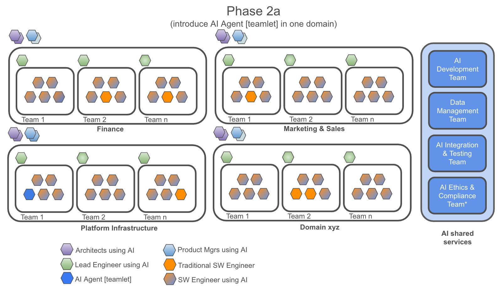

*Source: Author*

Behind the scenes the AI Agent we are introducing is really made up of a combination of multiple smaller agents interacting with each other. This is important because multi-agent output is typically far superior than a single-turn interaction with a human being, as documented earlier. This cute DALL-E image captures the essence of the team:

*Source: DALL-E and the author’s imagination*

A more apt, but far less cooler term to use here is an Agent Teamlet. This is why I adopted the term AI **Agent** with a capital “A” to differentiate it with the actual atomic agents. However I use the Teamlet and Agent interchangeably throughout the document

Zooming in into the AI Agent (aka Teamlet) we can see below numerous different agents, each backed by the same or different LLMs (depending on their specialization)

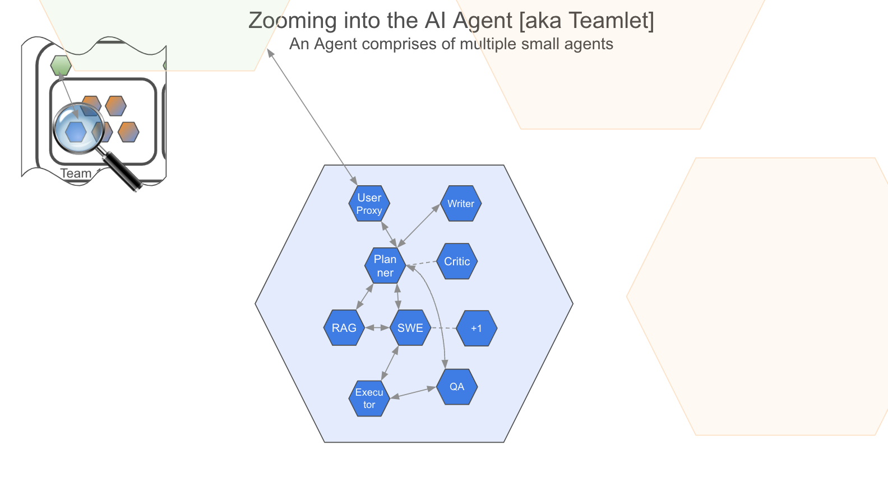

*Source: Author*

The agents shown within the teamlet could have the following characteristics and responsibilities

| agent’s name | Responsibility                                               | Interacts with                     | Applicable LLM                                               |
| ------------ | ------------------------------------------------------------ | ---------------------------------- | ------------------------------------------------------------ |
| User Proxy   | Takes inputs from the Lead Engineer, either mid-steps or after full interactive tasks are complete | Lead Engineer (human)Planner agent | Mistral (OSS)                                                |
| Planner      | Creates an execution detailed step by step plan (think what humans do for 1 point user stories) | Critic RAG SWE QA                  | Orca2 (OSS) [good at reasoning]                              |
| Critic       | Evaluates and sharpens the plan created by the planner       | Planner                            | Orca2                                                        |
| RAG          | Retrieval augmented generator pulls data from different sources such as an internal or external website, or documents and provides it back with context and references | PlannerSWE                         | Phi-2Deepseek coderCodellamaGPT4                             |
| SWE          | Software engineer: Builds the software to spec receiving relevant context and knowledge from RAG, sends to executor to run, fixes defects identified in run-time, or issues identified by code reviewer, and provides results bcak to Planner | RAG+1Executor                      | Custom internal model built on pre-trained coder such as Phi-2 |
| +1           | Code reviewer: reviewers SWEs code for quality, functionality, and any other relevant ‘ility. | SWE                                | Same as SWE’s                                                |
| Executor     | Run-time environment which locally installs dependencies and runs the code created by SWE and provides output | SWE                                | Phi-2                                                        |
| QA           | At Planner’s trigger, runs bespoke outside-in tests for integration, failure, regression testing on the code. | PlannerExecutor                    | Same as SWE’s                                                |

The above is just an example of the interactions and the agents that would be required to fulfill the coding part of the job of a human engineer. It is not complete. For instance, it is missing how the environments are going to be handled etc. That may require a completely separate teamlet just to prepare prior to this one being able to step through its instructions. The goal here was just to explain the general concept of the Agent with a capital “A”.

This phase allows the Lead to fine-tune the prompts and roles for the various multiple agents.

Below is an example conversation amongst these agents taken from one of the Autogen reference examples [21]. 

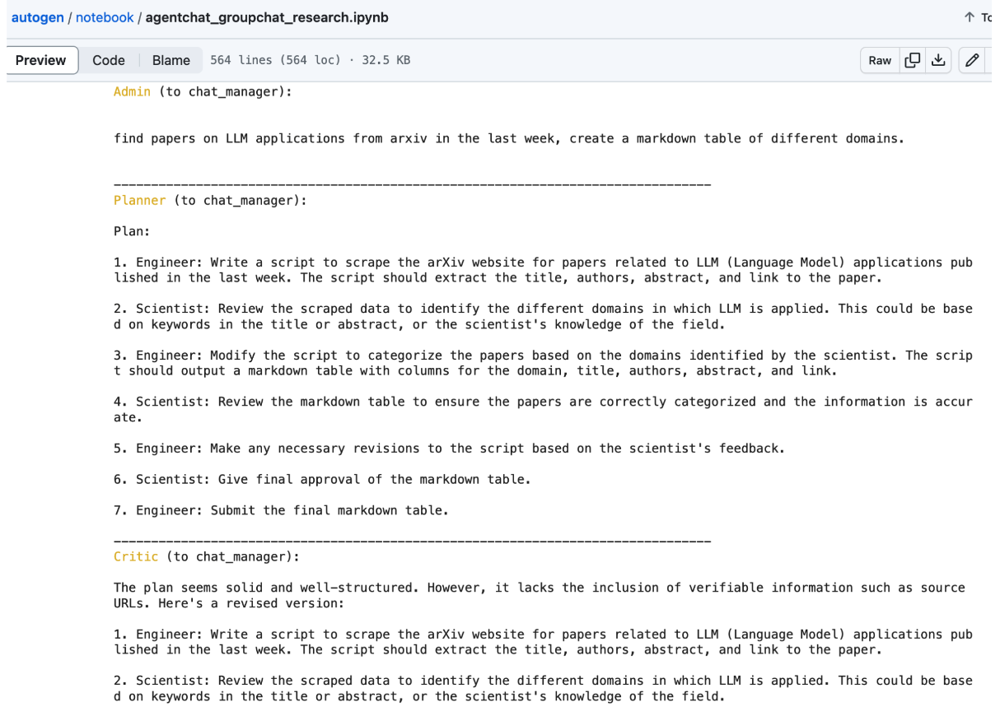

*Source:* *[25] Autogen :* [*Multi-agent examples*](https://microsoft.github.io/autogen/docs/Examples) *showing how mini agents talk to and critique each other to produce a superior final output..*

### Exit criteria for Phase 2a

Phase 2a can be considered successful when the AI-SWE Agent (teamlet) is able to take on real coding user stories from the board, work them and most importantly, their pull requests are at the level of quality that they are consistently being approved by the lead engineer and merged into the mainline.

We are now ready to bring these Agents into other domains.

## Phase 2b : Introducing the AI SW agents into other domains

This Phase is more of a rinse and repeat of Phase 2a. The differences here would be introducing other lead engineers and architects to this model of working, and the training of custom LLMs suitable for that domain. For example, the custom LLM coder created for the Customer Support tech team will need to be fine-tuned on a different set of software repositories, application documentation , and perhaps may even require a modified set of helper functions (if their software workflows are different) than the custom LLM created for, say, the Finance tech team.

*Source: Author*

By this time we should start introducing more than one AI Agent into a scrum team such as Team 1 in the Platform Infrastructure domain in the figure above. This would not only help with parallelism (i.e. Agents taking multiple user stories from the board simultaneously in the same sprint) but also provide a segregation of very different duties, such as one Agent fully taking on environment creation, and test harness setup, while the other one taking on writing and deploying code to that environment. 

Funny aside: My brother, a major fanboy of Star Trek drew comparisons of this concept with the Bynar species [26] which worked in pairs and whose thoughts were interconnected to each other enabling them to communicate rapidly and efficiently. Gene Roddenberry would be so elated how AI Agents are materializing his vision!

*Source:* *[26] Fandom :* [*Star trek Bynars*](https://memory-alpha.fandom.com/wiki/Bynar)

### Exit criteria for Phase 2b

Phase 2b can be considered complete when each applicable domain has at least one AI Agent online and successfully takes user stories from the board, working on them, and updating the work management systems. Most importantly, their pull requests are at the level of quality that they are consistently being approved by the lead engineer and merged into the mainline.

We are now ready to enter phase 3.

## Phase 3a : Introducing a semi-autonomous AI-team into a domain

This is the phase where a team is fully composed of AI-SWE Agents. 

A fundamental shift from Phase 2 to Phase 3 is that in this phase, the team is working full and complete Epics, with each of its Agents picking up user stories and coordinating across each other to complete the work. 

Separately, this paradigm shift with AI fully developing software may also affect the way we chunk work in software (Projects -> Epics -> User Stories -> Tasks). Keep in mind that the current way to break down work was done to accommodate human-driven software development. The work breakdown modality for AI-driven development is beyond the scope of this article and will naturally evolve over the upcoming years. For the sake of familiarity (and simplicity!) we will continue to use traditional agile terms like Epics and User Stories here.

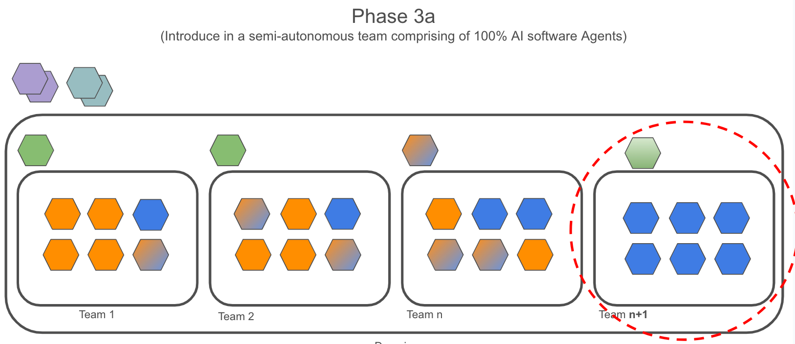

*Source: Author*

In this phase, a higher order plane of communication needs to be established between the various Agents (Teamlets), which may mean interaction across one atomic agent within one composite Agent (TeamLet) is connected and communicating across with another agent inside another composite Agent. It could also mean these agents are collaborating via the work management system and issue boards such as Github issues. These specifics are not relevant. More important to note is that each Agent would have complete autonomy for certain tasks. These roles could be:

- Software development Agents (detailed earlier in Phase 2a)
- Product Management Agents which could author and flesh out Product Requirements documents and chart out roadmaps under the supervision of human product managers
- Technical Writer Agents responsible for customer-facing documentation, internal software documentation, slide creation for All-hands wins, updates to the IT portfolio
- Research Assistants supporting the architects and Product Managers helping with external research around business capabilities, SWOT analysis and so on.
- Operations Support Agents, which activate directly through system alerts, or manually when triggered and pointed towards issues to troubleshoot

Essentially, these teams become a self-contained unit for a complete product accountable for end to end responsibility. Important to note is that design for AI Agent roles is different than those for humans [27] and we will leave some flexibility for what the most optimum roles would need to be when we get empirical feedback through initial attempts.

Recent studies [28] have shown that coding, communication and planning are areas AI-SWE is starting to get better at, in the realm of writing pure software. However, for AI to accomplish some of the activities expected in this phase autonomously requires Generative AI to do a more advanced level of thinking called system 2, or slow thinking. [29] As of this writing we are not there yet, which means much of the rational, complex thinking required during operations troubleshooting or product management activities will still require hand holding and human intervention.

However, breakthroughs are expected in this space during 2024, potentially by 2H [2] . Still much of the full epic development should still be achievable with current state capabilities and LLM customization.

*Source: [2] Andrej Karpathy [1hr Talk] Intro to Large Language Models*

An area to note is that AI does a great job with functional requirements but it is not as capable (yet) with non-functional requirements (NFRs) which include performance, trust and scale [30]. There is human intervention needed to ensure the benchmarks of the organization for these NFRs are indeed developed to spec. This could mean as little as having human end to end testing capabilities (with the tests of course also developed and run through AI Agents, but with human signoff) or as much as human-driven software enhancements to add the expected NFR capabilities.

### Exit criteria for Phase 3a

This phase expects a level of sophistication which is a little further out to be prescriptive about the exact exit criteria, but generally speaking a good barometer of success is to expect full Epics being developed from requirements to functional solutions running in QA. There may still be a need to require human verification on whether Non-functional requirements (NFR) are developed to spec.

## Phase 3b : Rolling out AI teams into other domains

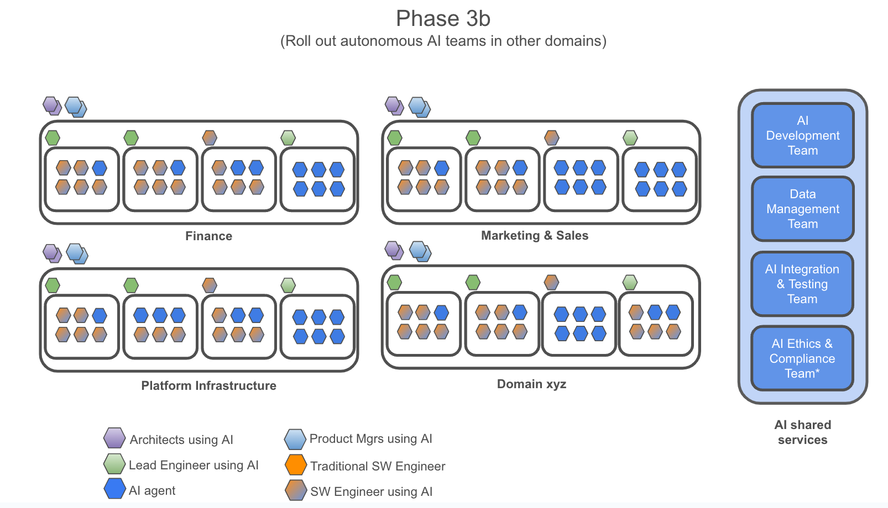

*Source: Author*

Leveraging the lessons learnt from AI teams in one domain, this phase introduces the autonomous AI teams into other domains. This also starts to raise some of the senior engineers to the level of lead in order to scale out the teams.

An aspect that is not depicted here but is worth mentioning is the need for an end to end QA team (which should be a hybrid team of AI + human engineers). End to end QA is important since these AI Teams may be developing against separate epics’ user acceptance criteria, but the end to end experience would still need to be verified and integration-tested when all of these come together prior to a release. This also extends across performance testing needs. Eventually, when the muscle is developed well enough, the QA function can also be trained into an LLM, but I foresee it happening later than the Software development function, simply because of the complexity of interdependencies. This still does not preclude the QA function to heavily utilize AI Agents to evaluate, write and deploy automated tests and automated reporting in earlier Phases.

### Exit criteria for Phase 3b

Exit criteria for this phase is surprisingly straightforward: A critical mass (80-100% as decided by executive leadership) of functional AI Teams have been deployed and are contributing to each domain and a **clear difference in lead time to change is starting to be observed**.

## Steady State (Phase n) : Scale out AI teams, Decentralize AI shared services

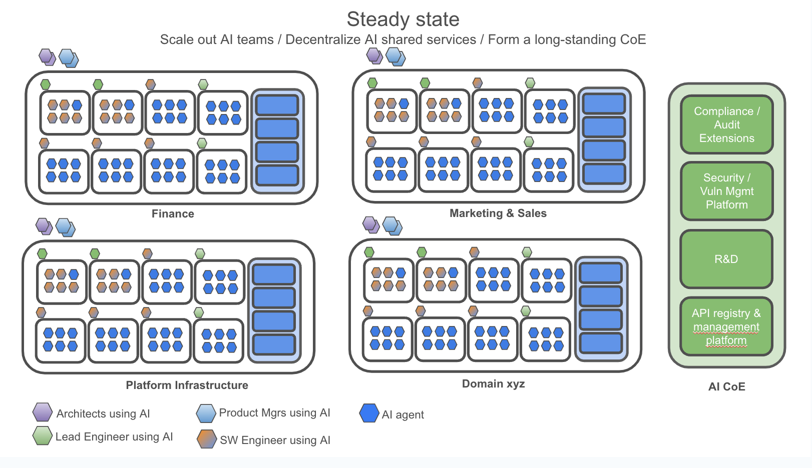

*Source: Author*

**Scaling out AI teams**

By this time the domains are getting comfortable with the quality of the work of the AI teams, and more and more hands-on software engineers start getting upleveled and elevated to become leads, or **AI Engineers [16]**, of their own AI Teams. While I’m showing a mapping of only one AI Team per human engineer, there is no reason why multiple teams cannot be operated by the same human engineer. The bottleneck of velocity will naturally move to these human AI engineers, but by this time the firm should be enjoying dramatically reduced lead time to changes already. The skills that these AI engineers would need to focus on would still have a modicum of software since they are still on point to review and approve the Pull Requests being sent by the various AI Agents, and review the documentation being created by them and so forth. However all human engineers would need to focus on inimitably human skills referenced in section “Good engineers have nothing to fear”

Note that there will always be a need for a handful of human driven software teams. These would be higher order functions however, and their job would be a safety net for the domain. As mentioned earlier, a good example of this is to ensure NFRs are being delivered to specification, but there will be other AI shortcomings that will surface. It is important that these are documented and shared with the domain’s AI Development teams so future versions of the domains’ custom LLMs are superior. 

**Decentralizing AI Shared Services:**

When technology and products start to mature, it is my experience that the shared services teams started becoming a bottleneck to velocity. Therefore in steady state all organizations must plan to decentralize any AI Shared services team into each domain. This means that each domain builds native muscle to customize their own AI LLM models, to curate the training data, and to maintain custom integrations that are peculiar to them.

The shared services team starts to modify into a Center of Excellence (CoE) organization which cares for the services that would always be horizontally required and are better if left standardized. This includes some of the common integrations. For example, all domains will continue to need their AI Agents to be able to integrate with the IT CI/CD pipeline team, or to interact with Github, sonarQube and work management systems like Jira, Asana, BaseCamp etc.

Since IT systems can always get audited, this CoE can create and maintain extension packs which teams can plug in and create audit reports (ie. an iteration of the ethics and compliance team from the prior shared services group). 

There has been research that shows developers getting assistance from AI for writing code tend to write less secure code, and what is more troubling, they are over optimistic about the safety of this code [31]. This problem may get worse with fully AI powered teams. This is why it is important that a **central** check on code quality and library selection is maintained. This may require the CoE to create its own sentinel software which is able to keep track of secure code and infrastructure across the domains, as well as to automatically track and add items in the backlog of these teams and report on the overall security posture centrally. If a company already has a strong, well staffed central security organization which has software engineers of its own and are deeply plugged into IT, there is no reason why this function cannot be run out of there as well.

**Application Architecture** could also become a bottleneck for velocity if it was not composable, and event driven to start with. This is something to be aware of and if the Phase 0 assessment was completed fairly, should have also been caught within the scoring and prioritization step for each application.

# Counter arguments

Here’s a little “behind the scenes” story. When I was in the middle of writing this article, I asked chatGPT to take an opposing stance and explain what the problems would be with having less reliance on human-driven software engineering. The feedback, which I abbreviated below, actually helped me refine my proposed phases such as raising the level of human engineers to a higher but even more crucial level, and having an autonomous team being run by each existing engineer in the team.

What follows is chatGPT’s counter arguments, with my responses each of its arguments inline:

Here are some counterarguments to consider:

**1. Complex Problem-Solving and Creativity:**

  \- Human developers excel in creative problem-solving and dealing with novel situations. AI, while excellent at handling routine tasks, may struggle with unique or complex problems that require out-of-the-box thinking.

  \- Creativity in design and innovation is a distinct human trait that AI cannot fully replicate, especially in areas requiring emotional intelligence and understanding of human experiences.

*My response: Valid point. This made me think about how I can raise the level of the existing engineers and place them in the organization where more of their creativity and out-of-the-box thinking can take place. That typically is required when you’re closer to the customer, which is what happens where you are playing a lead engineer role (See Steady State: Phase n)*

**2. Quality of Code and Maintenance**

  \- AI-generated code may lack the nuanced understanding that experienced human developers bring, potentially leading to issues in maintainability, scalability, and performance.

  \- Human oversight is crucial for ensuring code quality, particularly in complex systems where understanding the broader context is important.

*My response: I was also thinking of the same thing as the various papers I have quoted express AI-SWE’s weakness in non-functional requirements. This is why even in the steady-state, I opted to keep a few actual human-based engineering teams which ensure trust, operational resilience and performance aspects of the software have been taken into account.*

**3. Ethical and Social Implications:**

  \- Replacing human workers with AI raises significant ethical concerns, including the impact on employment and the broader social implications of reducing the human workforce.

  \- There's a risk of losing valuable human skills and knowledge accumulated over years, which are not easily transferable to AI.

*My response: I accounted for this. While I foresee IT organizations will stop growing at the same rate, the fact that existing engineers will be repurposed to do higher-order work will ensure meaningful employment while giving them better visibility to senior leaders and to businesses. Of course this does mean that the existing engineers would have to grow their skills that traditionally belonged to Product Management, and the product managers would need to get comfortable steering AI teams and frameworks.*

**4. Lack of Adaptability and Intuition:**

  \- AI systems, even advanced ones, may not adapt well to rapidly changing environments or requirements, a common scenario in software development.

  \- Humans can intuitively navigate ambiguous or poorly defined problems, a capability that AI currently lacks.

*My response: Correct, and that is why each AI-SWE team does have a human engineer steering it. AI-SWE will still need explicit and low level instructions and tweaking as the interface on the other side of the application is still a human which only another human can empathize with.*

**5. Security, Dependability, Regulatory and Compliance Issues:**

  \- AI systems can be vulnerable to specific types of failures, biases, and security issues that are different from those encountered with human teams.

  \- Dependence on AI for critical development tasks might pose a risk in situations where AI behavior is unpredictable or erroneous.

  \- AI systems may not be fully equipped to handle the legal and compliance aspects of software development, which often require human judgment and understanding of the law.

  \- There might be regulatory challenges or restrictions in certain industries or regions regarding the use of AI in critical development roles.

*My response: Good point. This made me add a responsibility under the Center of Engineering team for security and compliance, even in steady-state. After reading the point about regulatory challenges in certain industries (or geographic locations), I did add a caveat in the article that the AI-SWE model may not be applicable in such industries, and the use of AI for development may have to be in a much more controlled fashion.*

**6. Communication and Collaboration:**

  \- Effective software development often requires nuanced communication and collaboration with stakeholders, something that human teams are inherently better at.

  \- Understanding client needs, empathizing with end-user problems, and negotiating requirements are areas where human interaction is crucial.

*My response: Agreed, and that is why the AI engineers and Product Managers both will be in place to handle the communication aspects with human stakeholders.*

**7. Costs of Transition and Maintenance:**

  \- The initial investment in developing, training, and integrating AI systems for software development can be substantial.

  \- Continuous maintenance, updates, and training of AI systems to keep them effective can also incur significant costs.

*My response: I can see how GPT4 may have been thinking that I would be doing the pre-training part in house, which is a wrong assumption. I’m banking on using available pre-trained base models to fine tune to the internal IT software code repositories.*

**9. Limited Scope of Understanding:**

  \- AI, even with advanced capabilities, may not fully grasp the business context or the subtleties of the market and user needs in the way humans do.

  \- There's a risk of AI solutions being too narrowly focused, missing the bigger picture that human developers often consider.

*My response: Agreed, and that is why the AI engineers are still steering the AI-SWE teams in the final state.*

**10. Risk of Overreliance:**

  \- Over-reliance on AI can lead to a decline in human expertise within the organization, making it vulnerable to AI failures or limitations.

*My response: This is correct and I agree with this sentiment. However, this is a more general risk that the entire software industry is going to face. I’m not sure how we can avoid this at this point. In short, I don’t think anyone has an answer to this, but I guess we shall find out together over the next few years :)* 

# Good engineers have nothing to fear

First, let’s address the topic of **fear** head-on. It is clear from social media studies done on software engineers’ sentiment about AI [30] that fear is by far the dominant emotion amongst developers. It is important to acknowledge this.

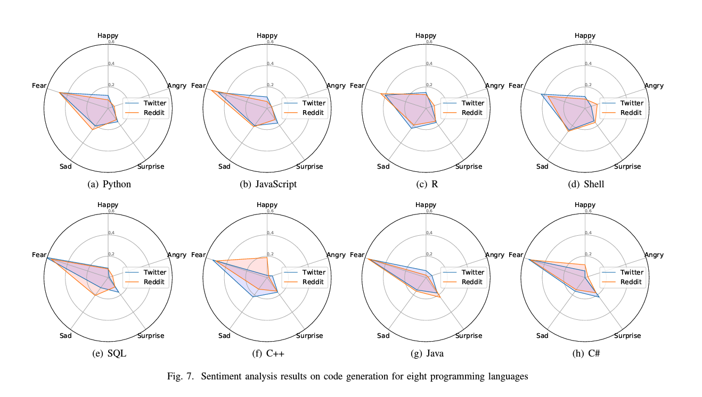

*Source: [30] Feng et al , Investigating Code Generation Performance of Chat- GPT with Crowdsourcing Social Data*

At the same time, let’s take a step back and look at the complete set of skills that good software engineers have [32] 

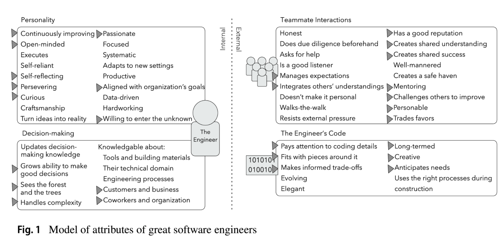

*Source: [32] Li et al, What distinguishes great software engineers, marked up by the author to highlight the skills which will withstand the AI paradigm shift.*

In a summary of many studies done around great software engineers’ traits, you can see that the coding part is just a subset of what makes these engineer’s great. If you look at the chart above, I’ve marked with a gray arrow all the areas which an AI agent, despite how advanced it gets, will never be able to imitate. In my opinion these are the inimitable skills that all software engineers should intentionally hone and perfect as they will be what distinguishes them and keeps them valuable in the new AI-SWE paradigm-shift. Indeed, these are exactly the skills that would be accentuated and in demand in the Steady state phase of the AI-powered IT firm that I depicted above.

# Conclusion - The storm is coming but are you ready?

*Source: [33] Ben Evans: AI and Everything Else, Slush Conference, Helsinki Dec ‘23*

I’ve been in the technology industry for over 20 years, and have seen my share of tech bubbles and busts, disruptions in infrastructure (on-premise to cloud) and processes (waterfall to agile). I can say that what we are witnessing now has to be the biggest tsunami ever to hit us in the software world. But don’t just take my word for it, check out what Bill Gates has to say [34]. The barriers of entry for getting into building software-based technology are going to be wiped out, the lead times from idea to market will reduce, firms previously not even working in the same stratosphere will start competing, and new nimble companies will emerge which will threaten great legacies. Many of us work in these existing large firms, and some of us are in senior positions to influence the course of the ship. Perhaps some of these successful firms will not even acknowledge that this is even an existential crisis approaching until it's too late. I imagine several will sense the change approaching but would prefer to stay in the warm comfort of the existing status quo. 

And that is precisely where the opportunity lies. The few firms that will actively do something about it, will position themselves to break away from the pack, and will be in a **dominating** position when the change will start to accelerate. These firms will be the great ones. They will outlast all others and when the dust settles and the smoke clears they will be standing stronger than ever.

*This content contains my opinion and is not intended to be understood as the official position of my employer.*

## References

1. Hailin Chen Caiming Xiong et al. [ChatGPT’s One-year Anniversary: Are Open-Source LLMs catching up?](https://arxiv.org/pdf/2311.16989.pdf)
2. Andrej Karpathy [[1hr Talk\] Intro to Large Language Models](https://youtu.be/zjkBMFhNj_g?t=1072) (timestamped at “stages of creating an LLM”)
3. Microsoft - [Phi2: The surprising power of small language models ](https://www.microsoft.com/en-us/research/blog/phi-2-the-surprising-power-of-small-language-models/)(highly performant coder base model)
4. Eric Hartford [Meet Samantha](https://huggingface.co/) - A baby step towards sentient AI
5. Meditron](https://ollama.ai/library/meditron) - Open-source medical large language model adapted from Llama 2 to the medical domain.
6. Erik Nijkamp, Donald Rose - [Conversational AI Programming with CodeGen: Let AI Write Code For You](https://blog.salesforceairesearch.com/codegen/)
7. Eldan et al - TinyStories: [How Small Can Language Models Be and Still Speak Coherent English?](https://arxiv.org/abs/2305.07759)
8. Gunasekar et al - [Textbook is all you need](https://www.microsoft.com/en-us/research/blog/phi-2-the-surprising-power-of-small-language-models/)
9. Duan et al - BotChat: [Evaluating LLMs' Capabilities of Having Multi-Turn Dialogues](https://arxiv.org/abs/2310.13650)
10. ChatDev: [easy-to-use LLM-based framework for collective intelligence.](https://github.com/OpenBMB/ChatDev)
11. MetaGPT: [Given one line Requirement, return PRD, Design, Tasks, Repo](https://github.com/geekan/MetaGPT)
12. Autogen (by Microsoft): [Enable Next-Gen Large Language Model Applications.](https://github.com/microsoft/autogen)
13. Crew AI: [Framework for orchestrating role-playing, autonomous AI agents.](https://github.com/joaomdmoura/crewAI)
14. Oliver Morris: [Can AI Team Up with Itself for Our Benefit?](https://medium.com/@olimoz/the-collaboration-code-from-ai-solo-act-to-symphony-303d975832fe)
15. Waseem et al: [Autonomous Agents in Software Development: A Vision Paper](https://arxiv.org/abs/2311.18440)
16. Swyx: [The Rise of the AI engineer](https://www.latent.space/p/ai-engineer)
17. Douvantziz: [Coding with AI auto-completion – How does Copilot weigh up?](https://nordcloud.com/tech-community/coding-copilot-ai-autocompletion/)
18. Chelsea Troy - specific reference to Context Loss in her article: [Reducing Technical Debt](https://chelseatroy.com/2021/01/21/reducing-technical-debt/)
19. Autogpt: [Fine-tune your agent to perfection](https://github.com/Significant-Gravitas/AutoGPT)
20. Feng et a, [Codebert: A pre-trained model for programming and natural languages](https://arxiv.org/abs/2002.08155)
21. Autogen: [RAG example on teaching an agent a new software library to use for its coding assignment](https://github.com/microsoft/autogen/blob/main/notebook/agentchat_groupchat_RAG.ipynb)
22. DC Palter: [7 Things Experienced Founders Know that 1st Time Founders Miss](https://entrepreneurshandbook.co/7-things-experienced-founders-know-that-1st-time-founders-miss-6f0e919a751c)
23. Sobania et al.[ An Analysis of the Automatic Bug Fixing Performance of ChatGPT](https://arxiv.org/abs/2301.08653)
24. Tian et al [Is ChatGPT the Ultimate Programming Assistant -- How far is it? ](https://arxiv.org/abs/2304.11938)
25. Autogen : [Multi-agent examples](https://microsoft.github.io/autogen/docs/Examples)
26. Fandom : [Star trek Bynars](https://memory-alpha.fandom.com/wiki/Bynar)
27. Oliver Morris , [How professional can AI teams get](https://medium.com/@olimoz/how-professional-can-agentic-ai-teams-get-a75ffe5a0083)
28. H Hörnemalm, A. (2023). [ChatGPT as a Software Development Tool : The Future of Development ](https://urn.kb.se/resolve?urn=urn:nbn:se:umu:diva-209909)
29. Kahneman, [Thinking fast and slow](https://www.amazon.com/Thinking-Fast-Slow-Daniel-Kahneman/dp/0374533555)
30. Feng et al ,[ Investigating Code Generation Performance of Chat- GPT with Crowdsourcing Social Data](https://yunhefeng.me/material/COMPSAC___SETA_23.pdf)
31. Perry et al, [Do Users Write More Insecure Code with AI Assistants?](https://arxiv.org/abs/2211.03622)
32. Li et al, [What distinguishes great software engineers? Empirical Software Engineering](https://faculty.washington.edu/ajko/papers/Li2019WhatDistinguishesEngineers.pdf)
33. Ben Evans: [AI and Everything Else, Slush Conference, Helsinki Dec ‘23](https://www.ben-evans.com/presentations)
34. Bill Gates: [The Age of AI has begun](https://www.gatesnotes.com/The-Age-of-AI-Has-Begun)

## Glossary

- AI Agent : A multi-agent superset of AI agents working together
- AI agent : An agent backed by a generic or specialized large-language model
- AI Teamlet : same as AI Agent
- AI-SWE : AI-driven Software Engineering: Software written, debugged, built and deployed by AI Agents & AI Teams.
- CI/CD : Continuous Integration & Continuous Delivery
- CoE: Center of Excellence
- CRM: Customer Relationship Management system
- H-SWE: Human-driven Software Engineering: Software , debugged, built and deployed by human beings
- MVP: Minimum Viable Product
- OSS: Open Source Software
- RAG: Retrieval Augmented Generation
- SDLC: Software Development Life Cycle
