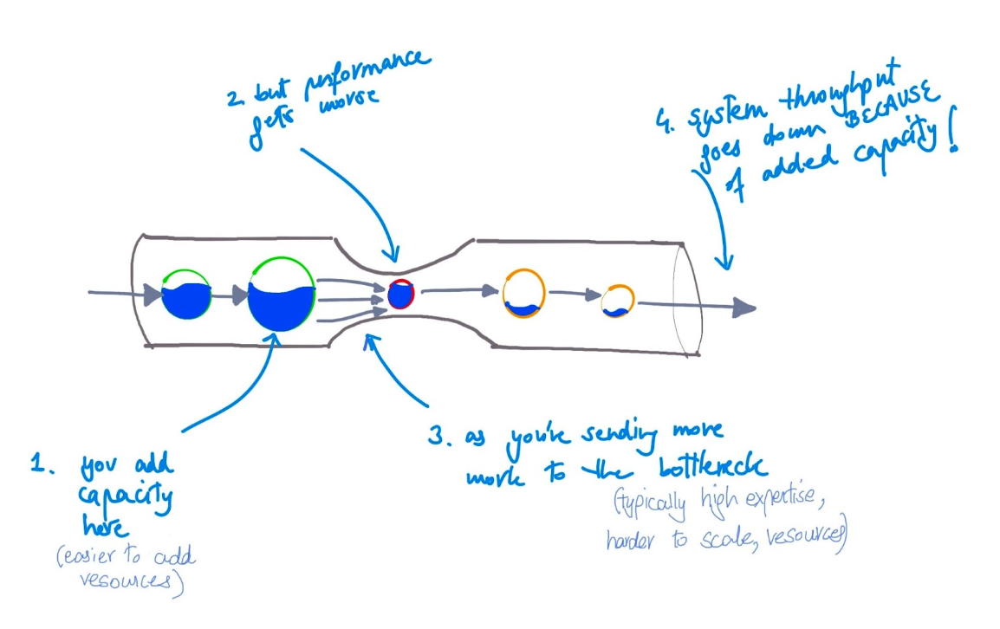
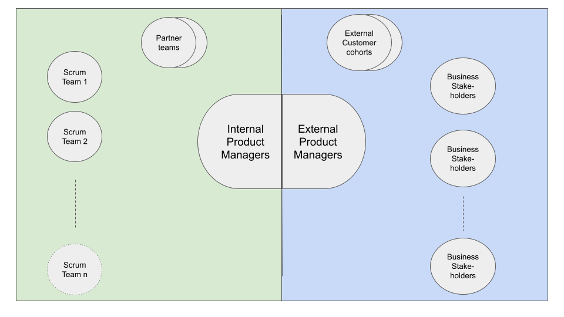
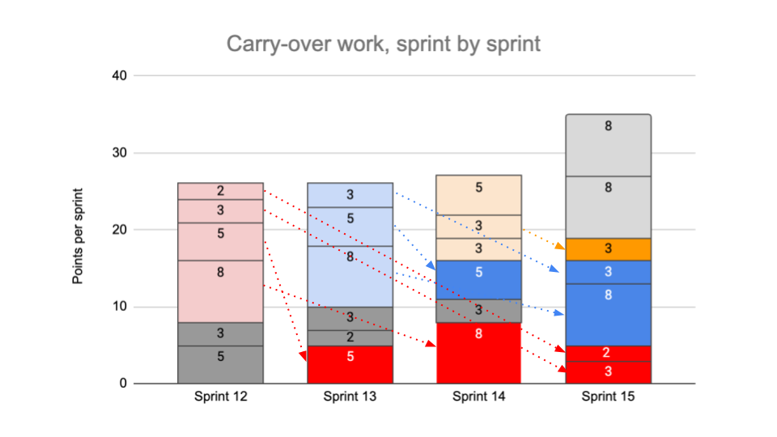
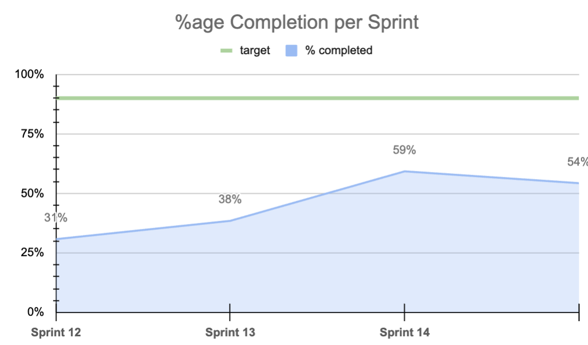
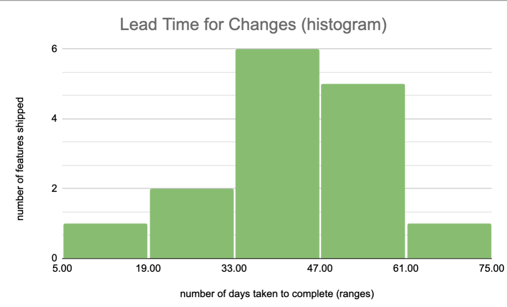
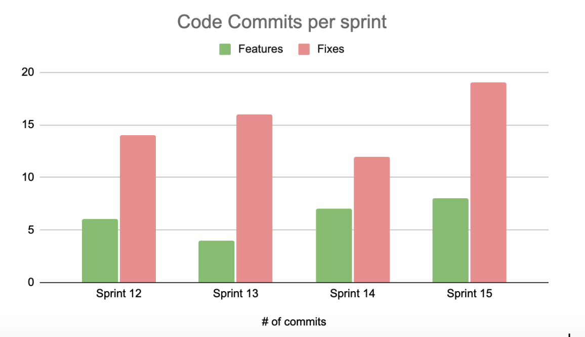

*Abstract: We did it! Delivered a major project in rapid time! We got a ton of funding, and then, the troubles started. There are plenty of stories out there around “how people built things from scratch”. This is the story of what happens next, **after** a successful launch.*

## Backdrop

A few years ago my team brought Salesorce’s first-ever video streaming service, [Salesforce Plus](http://www.salesforce.com/plus) to life. We did it in a dramatic 4 month turnaround, prior to Dreamforce 2021. It was a smashing success and got much fanfare. 

Internally in the company it got a lot of visibility, and much like other projects which bring value to the company, it got more funding, and the expectations for the next Dreamforce got raised.

…and that's when the troubles started…

This is the story of version 2. The release that follows the Minimum Viable Product, and it is something I have seen a few times in my career. This is typically where the “**problems of the plenty**” start. Plenty of funding, plenty of interest, plenty of new requirements, and plenty of challenges!

The complexity and variety of issues afflicting the product during this particular phase caused us to lose many months of quality development time. With only 3 months (or 6 development sprints) left and a mountain of unfinished work before the upcoming Dreamforce, we had a “do-or-die” situation. We could fail to deliver, and that would cause us to launch some crucial software features which would impact potential marketing pipeline. Bad for our team, bad for the company, and not acceptable!

*Note: All diagrams and figures in this article are directionally accurate to convey the concepts, but all numbers and labels have been anonymized. This will be a two part article. In the first part I talk about the problem and in the second one, I share what we did to resolve it*

---

## Surge Funding

Now, in IT, the fastest way to add capacity is through contractors and a healthy mix of an employee to contractor ratio is always good for the organization anyway. Typically, when a project is successful in its MVP launch, the business stakeholders want more of that and are willing to fund it. And adding capacity, if done thoughtfully, typically does yield value. However, if underlying bottlenecks already exist in the flow of work, and there always are, they become much more pronounced because they are stress tested. Indeed, some become full-on blockages when more work starts entering into the system.

Dr. Eliyahu Goldratt very articulately expressed this challenge in his seminal book, “The Goal” where he introduced to the world the “Theory of constraints” (TOC). TOC hypothesizes that every complex system consists of multiple linked activities, one of which acts as a constraint (aka, the weakest link) upon the entire system. ([link](https://www.linkedin.com/pulse/theory-constraints-real-estate-investing-cost-your-wyatt-powell)) We were about to learn this the hard way.

So, with a strong injection of capacity and a zest of ambitious software features, we were off to the races. Business stakeholders were truly excited. From a leadership perspective, all ducks were lined up in a row, and it was going to be a great unveiling of new features at Dreamforce.Inside the software development process, however, things were gunking up.

---

## There is friction in the system…

**Symptoms:** Since, at the time, we didn’t have clear [leading indicators][leadingindicators] [1] for our software delivery process, we did not know that things were starting to slow down. There were complaints from engineers around untested code being committed, the front end team started to complain that their code was not getting merged and deployed, and the weekly updates on progress to the executive stakeholders showed little progress week over week. After the 5th week, my business counterpart executive reached out to me in exasperation and said something is seriously wrong. 

[leadingindicators]: ## "What are leading indicators? Taken from economics, leading indicators are signals early in a business cycle that give you the opportunity to influence the future since they are forward-thinking insights and predictions."

### Disjointed Product and Engineering motions

Because of the way our organization had developed, we had a split product leadership situation. It was really a common story. Business was not satisfied by the IT product management team, so they decided to start building their own product management team. Eventually, there were product managers facing all our stakeholders in the business side, and they were sitting in Marketing. They were writing vision documents, conducting customer focus groups, collecting and creating detailed product requirements, creating roadmaps, and driving commitments. At the same time, there were also product managers sitting in IT, facing the software scrum teams, and their area of focus was to help translate the vision and business requirements into deep technical requirements, conduct lower level planning sessions with the architects, leads and software engineers, scope the work and drive the development and shipping of features to production.

Both these outward and inward product teams sat in different organizations, and the disconnect was starting to get more and more noticeable as the pressure of feature delivery intensified and the drumbeat of the approaching Dreamforce became louder and louder.

We checked with all the internal product owners, and everyone had different (but valid) complaints. Someone complained that the work we committed to deliver for a sprint kept carrying over to the next sprint, which was impairing our ability to commit to the next release. What made matters worse was that the outward product owner team was churning out new Product Requirements, figma, aka, wireframe designs, and getting the internal product managers to size them for the next sprint, while the work for the current sprint was not going to complete! The backlog was growing exponentially. A vicious circle.

As shown in the visual above (numbers are obfuscated but the pattern was present directionally accurate), every team was carrying over work to the next sprints, while getting fresh work to do that sprint. Someone else complained the code quality coming in wasn’t that great and not up to spec. When asked for details, there were no specific metrics to point to; these were anecdotal feedback coming in from the lead engineers. Someone else pointed at the pipeline                              having a rigid 2-week schedule to deploy all code to the website causing the issue.

We also had an interesting dynamic. The User Experience (UX) design team was a strong design agency funded by the business and the new capacity of front end developers mentioned earlier in the article, had come from the same agency. In essence, as soon as a new figma came out, the agency UX and developers worked closely and quickly developed code that was functional in a local environment and kept sending these new features as [Pull Requests][pullrequests] (PRs) [2] to the main software engineering team to review and accept. The main team was taking so long to merge this code that these front end developers were also getting frustrated and started blaming the leads for the slowness.

[Pull requests]: ## "What is a Pull Request? This software engineering concept is simple. Multiple developers are churning out code. When their piece of code is sufficiently functional, they package this code (what is called a series of commits) and request the gatekeeper, somebody senior, to pull this new code into the overall code of the application. The gatekeeper checks if this code is in healthy shape, and that it won&#39;t break any other things in the software and merges this code.So a developer commits code a few times, and when she feels the feature is in good shape, sends the PR in. The PR can then be reviewed, commented upon, rejected, or accepted by the gatekeeper."

With so many different reasons being stated for slowness without any clear data, everyone started pointing fingers at seemingly the most obvious (but incorrect) reason for the slowness: the software delivery pipeline. (After running the enterprise CI/CD pipeline for T-mobile in my prior role, I knew instinctively that this was a scapegoat and the issues were somewhere else!)

The fact that this pipeline was managed by a shared service team outside the actual delivery team actually made it easier for everyone to blame it vs looking internally on where the issues lay.

In his masterful book, “Thinking Fast and Slow” Daniel Kahneman, explains how human beings, when dealing with a complex or difficult issue, transform the question into an easier one that we can answer. For example, when asked “How happy are you with life”, we answer the question, “What is my mood now”. We had substituted the hard question on “Why are we not delivering features to production efficiently?” to “Why can’t we ship our code whenever we like?”

### Application Architecture issues

For the original MVP, there had been short-cuts taken to hit the aggressive deadline. The application architecture had been created at the same time the software was being developed and tested! Therefore, we had landed into a situation where our code base was not cleanly divided, and many of the features depended on changing the same code base in the same files again and again. It was like trying 50 prisoners doing a polka dance in a prison cell; you are inevitably going to be stepping on each other's toes! 

What tends to save you in such situations is proper [unit test][unittest] [3] coverage. That way, when someone else changes an existing piece of code and it breaks existing functionality, your unit tests start failing. A proper CI/CD pipeline starts to fail builds and doesn’t even let the commit make it through into a pull request. This is great, because it pushes the onus back to the developer to make sure her code is not only doing what it is supposed to, but that it also is not accidentally breaking prior functioning code.

[unittest]: ## "What is unit test coverage? Unit test coverage (also referred to as test coverage, or code coverage) is a piece of code written by the developer along with the feature code whose sole job is to test the functionality of that new or updated code. It attempts to verify if the goal that the code is supposed to accomplish is really being accomplished by calling that code with both working and non-working scenarios and looking for expected outcome (pass or fail) "

However, unit tests take energy to write, and , many times, developers in the rush to get features out the door tend to sacrifice unit test coverage, a common vice in our industry and one I was painfully aware of in my prior experiences.

And, guess what, our teams had fallen into this same trap.

### Just how bad was the slow down

We were getting all anecdotal input from our business stakeholders and the developers and product owners, but had to quantify how bad our velocity drop had become. We decided to come up with this metric

`% Work Completion = (Completed) / (Completed + Deferred)`

A score of 100% in a sprint meant that all the user stories written to complete for that sprint were indeed closing in that sprint. Likewise, a score of 80% completion meant that 20% of the stories for that sprint were being deferred to future sprints.

Note. Measuring deferred work is not something that is easy to measure in any work management system, be it Jira, Rally, Peregrine, or our custom salesforce tool called Gus. The fundamental reason is that when a user story that was supposed to complete in a 2-week sprint is not completed, teams just move that [user story][userstory] [4] to the next sprint, and the history of its original intended sprint is over-written. Therefore, we had to come up with a unique way to track which user stories were shifting to future sprints. The way we did this was adding a simple prefix in the 1-line description of the user story such as [3a], which implied that this was originally created and targeted to be completed in Sprint 3a (or first half of March).

[userstory]: ## "What is a user story? A user story is an informal, general explanation of a software feature written from the perspective of the end user. Its purpose is to articulate how a software feature will provide value to the customer. Developers are assigned these stories and they work to convert them into functional software features.(Source: Atlassian)"

Another data point we looked back was to see what our lead time to change was. This is one of the 4 key metrics from Dr Forsgren’s popular book on software efficiency called “Accelerate”.

The way to measure this metric is as follows. 

`Lead time for changes = ship date - start date`

Figuring out the “ship date” was easy. These user story IDs were also listed out in the release notes for each of our releases. Since we had a 2 week release cadence, it was not hard to find out the “ship date” of each user story ID by combing through the release notes and finding when it got shipped. 

The “start date” was a little more convoluted. We wanted to follow the definition of “lead time for changes” to the tee as laid out in the “Accelerate” book, and in the definition, the start time is measured as the day of the first code commit of that feature, not when the feature was initially thought up. 

The answer lay in github, specifically in the pull requests (PRs)[1]. Each PR typically has the user story ID in its description so one can tie that back to the requirements. (If you don’t do this in your firm, I highly encourage you to start doing it). To measure the first code commit , we had to manually look up all the PRs and find out the first commit ever made to that PR, and pull its start date. Eventually, we automated this to pull this data from the github API.

The output was insightful. The majority of our features were taking between 33 to 47 days to complete, cradle to prom. That was almost 3 sprints. With only 6 sprints left before Dreamforce, this time frame was clearly not going to cut it. Now we had a baseline to work against, the goal being to reduce the lead time to changes. Our focus shifted towards a “time and motion” study to assess how our development team was spending time in developing and testing these features..

### Lots of code being written but not much to show!

I started having quick huddles with the developers and joining sprint retrospectives, and what I wanted to see first was if the developers were getting swaths of time to write code. A problem I had experienced years ago in a different organization, was that there were too many meetings developers were being invited to, and they didn’t have any time in the day to do any programming. We had put things in place to fix this, like right-sizing meetings, having managers know enough depth of the technology so they didnt feel compelled to invite their engineers to answer questions their stakeholders or leaders had etc. Looked like these checks were in place, and furthermore, when we looked into our Github repositories, we saw a decent amount of code being committed as well. Furthermore, the [commits][commits] [5] were happening early and often, which is a good practice.

[commits]: ## "What is a commit and how is it related to a Pull Request? A commit is a set of lines of code that a developer has written and can package that to be sent to the main software code of the application. This is the time when her code leaves her laptop and is ready to be exposed to the world, critiqued by her peers etc. The best practice is to “commit early and often and let the sausage making be seen by all” ([ref](https://sethrobertson.github.io/GitBestPractices/#commit)). If developers delay their commits, they end up writing a lot of code, and when that code has a merge conflict with someone else’s code, it is incredibly hard to parse through the large body of merged code to find the issue, versus if it had been a smaller piece of more clearly traceable code commit. Github allows developers to pool a bunch of their commits into a Pull Request."

This was puzzling! If there was so much code coming in, why weren’t we making progress in shipping features into QA?

We started looking deeper into these commits, and saw a pattern.

We saw that there were more [commits][commits2] [6] coming in for defect fixes vs actual feature development. This was odd, and unexpected. Something was peculiarly off.

[commits2]: ## "Number of commits vs number of lines of code: What is a better measure? Looking at commits is a better measure than the number of lines of code, as the commit signifies a block of functionality completed. It can be just 1 line of code but could be the one line which fixes a nasty race condition defect which took days to find. Ofcourse, the number of pull requests are even better than commits, as those signify complete features (or defects) being fixed and sent to the next level environment for testing"

*It was akin to taking three steps forward, and two steps back.* The team was trying to build a mountain while also digging out of a hole, at the same time!

### PRs backing up!

We decide to look at a level higher than the actual code commit. The age of the “Pull Request”..

When we pulled out the number of open PRs, and started tracking that daily in a database, the problem was at once evident. We had a massive number of PRs which were just sitting there, stale, or sent back to the developers, but not accepted and therefore, not merged into the main code. It was a particularly heinous issue since newer PRs were being written on top of “older” code, while the older PRs had not yet been merged. Now the gatekeepers had a real hairy problem of trying to merge all these different PRs which were touching the same files (see [Application Architecture issues](#application-architecture-issues) ). When we talked to the leads about it, some of them were so frustrated with the process, they were actually ending up re-writing the features themselves as the merge conflicts were getting far too cognitively painful to resolve

This problem had always been there, but with a small team we got away with it, as , at any given time it was normally only one or two developers committing code against the same code-base, and merge conflicts were mostly avoided, and even when they happened, they were easily resolvable. This was not the case anymore with a larger front-end development team.

The stale pull requests had actually led us to the most crucial insight of all:

>  *“We had found our key leading indicator, the age of the PR.”

### Theory of constraints in action!

Recall my earlier reference to the Theory of Constraints. As we started getting deeper into the causes of this backup, a number of patterns emerged. The surge funding that we had injected into the teams had imbalanced the team. We had added too many front end developers who were vigorously pumping in Pull Requests and our leads were getting overwhelmed. This code was working fine in the developer’s environment when it was just her unique change but by the time it got to the leads, it was colliding with other developers’ pull requests, and as pointed out in the [Application Architecture issues](https://docs.google.com/document/d/1yEwpOCYFzGlVJu66m-4spO-zoeY24TCIHmWWleQN5tY/edit#heading=h.1rwmc8u06jsg). The merge conflicts were so bad at times that it was going to be easier for the lead developers to re-write the full feature by themselves; the same few lead developers by the way who were on the hook to review an ever growing number of PRs!

Further, as this code got released to the QA environment, it was making a mess in the integrated QA environment, breaking other features that had been already released. The QA team were working overtime filing defects, and since the features had been re-written and melded together with other features, these defects couldn’t be assigned to the original developers committing the code. So guess, who was having to fix these defects? Yes, the same lead engineers!

I had heard anecdotally that the leads had been working overtime but no one had been able to quantify the root cause. Now, with this data, we knew exactly why the work was all bottlenecking with them.

*Part 2 of this article continues the story on how we set up measures, redesigned our organization and then tracked our progress on a daily basis all the way to Dreamforce..*

---
## Definitions

- [1] What are leading indicators? Taken from economics, leading indicators are signals early in a business cycle that give you the opportunity to influence the future since they are forward-thinking insights and predictions.

- [2] **What is a Pull Request?** This software engineering concept is simple. Multiple developers are churning out code. When their piece of code is sufficiently functional, they package this code (what is called a series of commits) and request the gatekeeper, somebody senior, to pull this new code into the overall code of the application. The gatekeeper checks if this code is in healthy shape, and that it won&#39;t break any other things in the software and merges this code.So a developer commits code a few times, and when she feels the feature is in good shape, sends the PR in. The PR can then be reviewed, commented upon, rejected, or accepted by the gatekeeper.

- [3] **What is unit test coverage?** Unit test coverage (also referred to as test coverage, or code coverage) is a piece of code written by the developer along with the feature code whose sole job is to test the functionality of that new or updated code. It attempts to verify if the goal that the code is supposed to accomplish is really being accomplished by calling that code with both working and non-working scenarios and looking for expected outcome (pass or fail)

- [4] **What is a user story?** A user story is an informal, general explanation of a software feature written from the perspective of the end user. Its purpose is to articulate how a software feature will provide value to the customer. Developers are assigned these stories and they work to convert them into functional software features.(*Source:* [*Atlassian*](https://www.atlassian.com/agile/project-management/user-stories#:~:text=Summary%3A A user story is,simply put%2C software system requirements.))

- [5] **What is a commit and how is it related to a Pull Request?** A commit is a set of lines of code that a developer has written and can package that to be sent to the main software code of the application. This is the time when her code leaves her laptop and is ready to be exposed to the world, critiqued by her peers etc. The best practice is to “commit early and often and let the sausage making be seen by all” ([ref](https://sethrobertson.github.io/GitBestPractices/#commit)). If developers delay their commits, they end up writing a lot of code, and when that code has a merge conflict with someone else’s code, it is incredibly hard to parse through the large body of merged code to find the issue, versus if it had been a smaller piece of more clearly traceable code commit. Github allows developers to pool a bunch of their commits into a Pull Request.

- [6] **Number of commits vs number of lines of code: What is a better measure?** Looking at commits is a better measure than the number of lines of code, as the commit signifies a block of functionality completed. It can be just 1 line of code but could be the one line which fixes a nasty race condition defect which took days to find. Ofcourse, the number of pull requests are even better than commits, as those signify complete features (or defects) being fixed and sent to the next level environment for testing

  
